CUDA Path Tracer
================
Rebecca Feng

[LinkedIn](https://www.linkedin.com/in/beckyfeng0803/), [personal website](https://beckyfeng08.github.io/)
Tested on: Windows 11, AMD Ryzen 9 @ 2.50 GHz 8GB, GTX 5060
Visual Studio 2022, CUDA 13.3

## Resulting renders
| Creatures render — 1000 iterations | Monkeys render — 173 iterations | Unicorn render — 1004 iterations |
| ------------- | ------------- | ------------- |
| |  | |

| 2 Iterations | 100 Iterations | 750 Iterations | 1000 Iterations |
| ------------- | ------------- | ------------- | ------------- |
|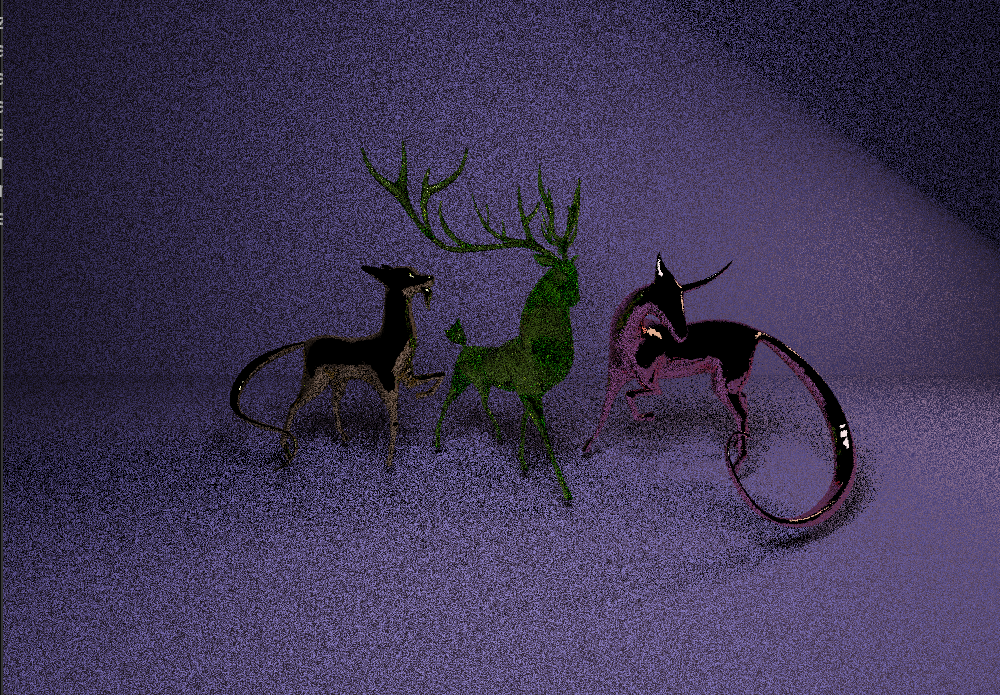 | 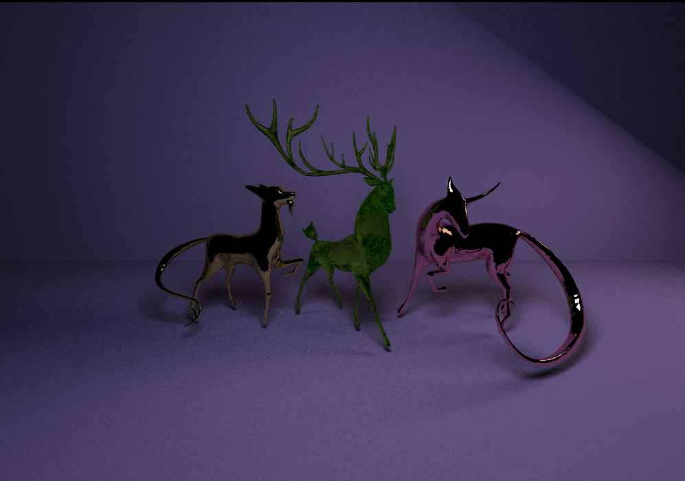 | 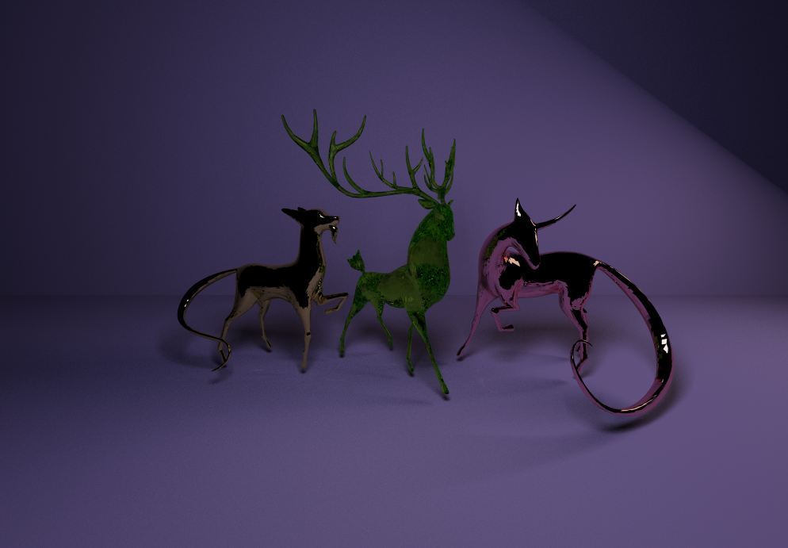| |

These scene files are included in scenes/blenderscenes folder
## Summary

This GPU accelerated pathtracer uses CUDA kernels to efficiently render scenes (specifically, one thread per ray). The following features are implemented in this pathtracer:
- GPU acceleration (CUDA)
    - Stream-compaction for ray termination
    - Sorting buffered rays/paths by material type in memory
- OBJ/custom JSON file loading
- Direct lighting
- Bounding Volume Hierarchies for triangle meshes
- Stochastic sampling for antialiasing
- Materials/BSDFs
    - Diffuse
    - Pure specular (reflective)
    - Dielectric (refractive)

## Contents
**Topics discussed in the README:**
1. [GPU Acceleration Details](#gpu-acceleration-details)
    - [Stream-compacted Rays](#stream-compacted-rays)
    - [Sorting by Material ID](#sorting-by-material-id)
2.  [OBJ loading](#obj-loading)
3. [Bounding Volume Hierarchies](#bounding-volume-hierarchies)
4.  [Direct Lighting](#direct-lighting)
5. [Dielectric Materials](#dielectric-materials)
6. [Acknowledgements](#acknowledgements)

## 1. GPU Acceleration Details
The repo uses CUDA kernels and the [Thrust library ](https://developer.nvidia.com/thrust) for GPU acceleration.
### 1.1. Stream-compacted Rays
Used the Thrust library's stream compaction functionality, where we terminate rays if they are labeled to have 0 "remaining bounces" left (meaning, for example, either the ray at its current state doesn't intersect with anything in the scene, is behind the camera, has a throughput color of black, or total internal reflection for refractive materials).

This method allows for faster renders, per iteration.

#### Performance
Without stream compaction, it is much slower to render out. Using a cornell box scene with a fully reflective teapot (using BVH and direct lighting), we plot out the time it takes to render 100 frames vs ray depth, with and without stream compaction:

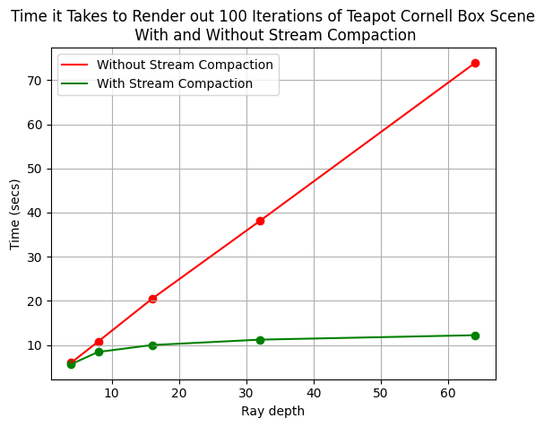

| Ray Depth | Without Stream Compaction (s) | With Stream Compaction (s) |
| ---------- | ------------------------------ | --------------------------- |
| 4         | 5.98                          | 5.65                       |
| 8         | 10.76                         | 8.41                       |
| 16        | 20.46                         | 9.98                       |
| 32        | 38.10                         | 11.20                      |
| 64        | 73.97                         | 12.21                      |

Utilizing stream compaction yields a logarithmic trend when dealing with higher ray depths, whereas it takes linear time when increasing ray depth when we don't have stream compaction. This is due to portions of the rays getting terminated early with stream compaction, so overall per depth count, there are less rays to do work.

###  1.2. Sorting by Material ID
We used Thrust to sort the intersections and pathSegment (ray) data structures by materialID in order to improve performance in our renderer. Theoretically, this is supposed to improve the time of our renderer; however, I noticed no difference, if not, slight adverse effects in implementation. For example, with 100k diffuse materials randomly assigned to 500k triangles in our scene, down below are the GPU profiling with and without material sorting:

**With Material Sorting**

shadeMaterial here takes 59.3% of the kernel processing, and around 3.65 seconds on average.
Furthermore, there is slight overhead (but negligible, ~0.5 ms) in terms of sorting due to thrust::sort.
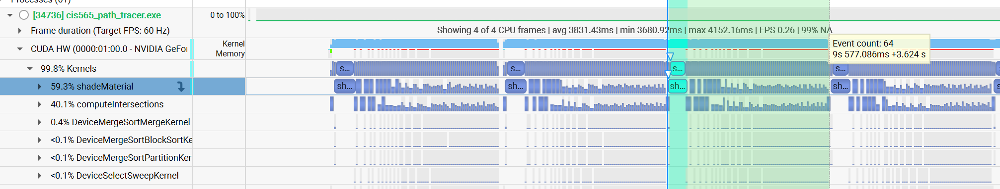 

**Without Material Sorting**

shadeMaterial takes 58.8% of kernel processing, takes on average 3.5 seconds. Less kernel groups due to thrust::sort not existing in the code.
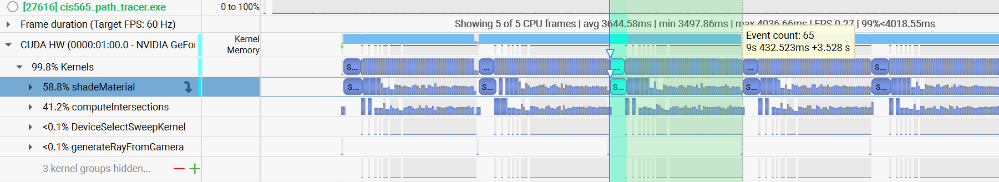 

## 2. OBJ loading

  | Before, no triangles  :( | After, yay triangles |
| ------------- | ------------- | 
|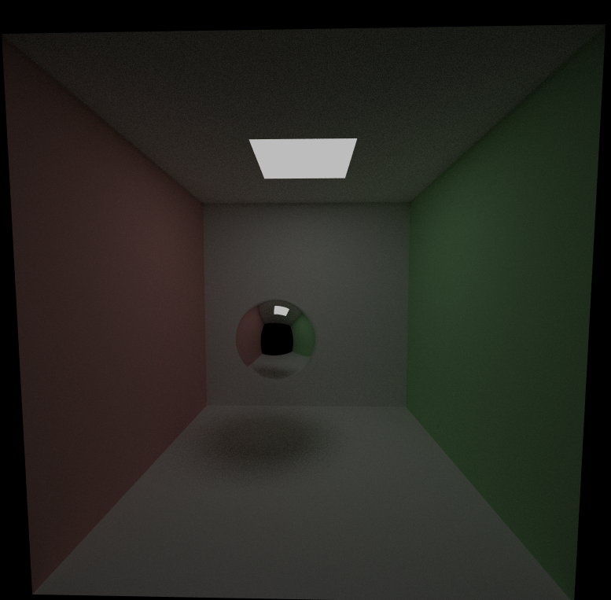 | 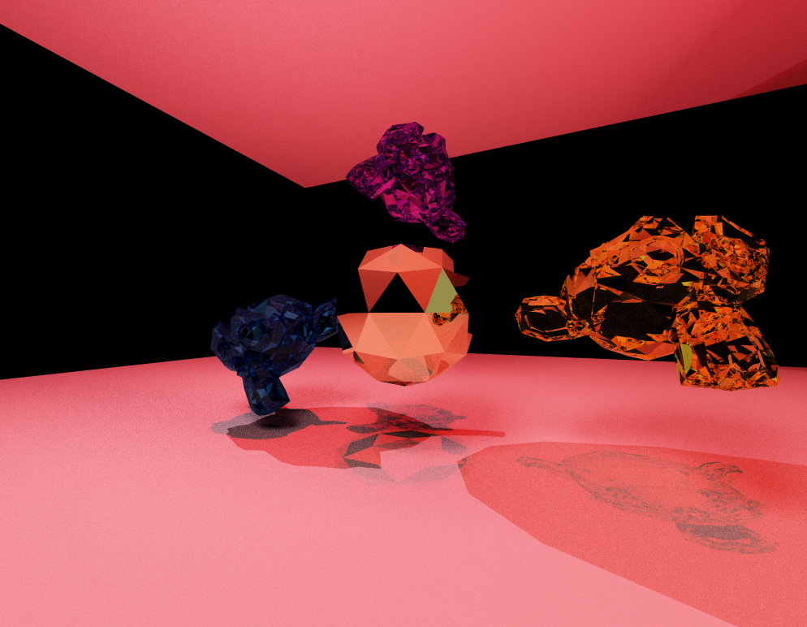 | 

This repo supports OBJ loading to render out triangle meshes. To support an arbitrary number of polys, we also combine our implementation with [bounding volume hierarchy acceleration structures](#bounding-volume-hierarchies) (in which we discuss the performance rendering out triangle meshes there). We utilized the [tinyobjloader](https://github.com/tinyobjloader/tinyobjloader) for file parsing.

## 3. Bounding Volume Hierarchies

Bounding volume hierarchies significantly sped up our implementation. Without BVH, for each ray, we would have to test intersection with all triangles in our scene. With BVH, we can check whether it intersects a section of our mesh at a time, so that intersecting triangles in our scene takes up O(logN) time instead of O(N) time, where N is the number of triangles in our scene.

  | 10 second render, No BVH (4 iterations) |  10 second render, With BVH (94 iterations) |
| ------------- | ------------- | 
|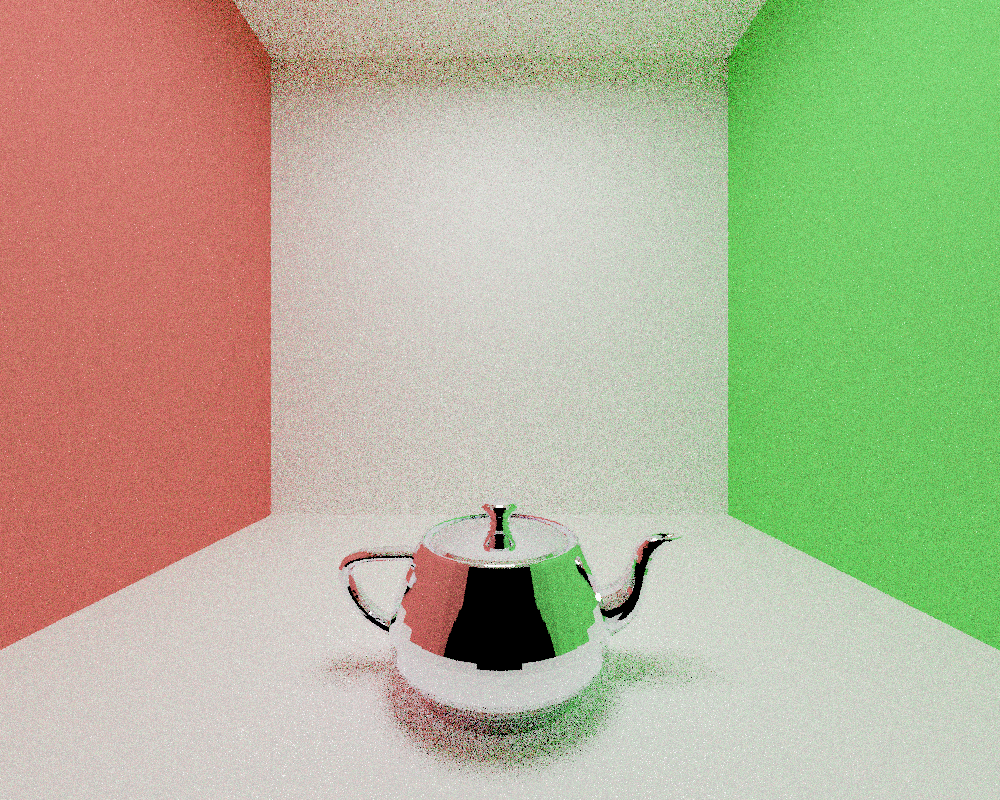 | 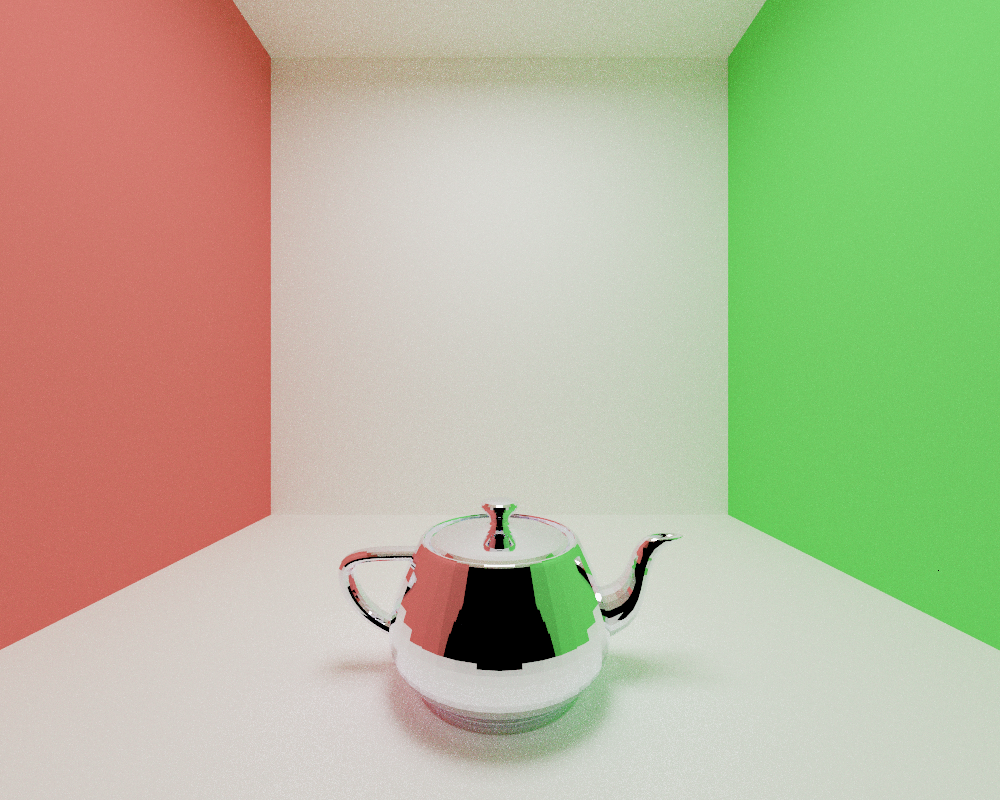 | 
The teapot has a fully reflective material, and has 6320 triangles.

As we can see, in just 10 seconds, a BVH is able to render out 94 iterations for a teapot, whereas without one, it is only able to render out 4 iterations.

The BVH construction takes place on the CPU, while when testing intersections on the GPU, we use an iterative approach in order to determine whether a given ray intersects triangles in our scene or not.

We also set a max tree depth of 16 and max number of leaves to 4, so for large scenes, we don't have to spend time going down our BVH tree, and also spend too much time iterating through triangles linearly at each leaf node. Furthermore, triangles that share the same leaf node are contiguous in memory, exploiting spatial locality. We also use std::nth_element during construction of our BVH, which performs in-place partitioning for our triangles rather than needing to copy data over.

Compared to a pure CPU approach with a BVH, we would have to test each ray individually, taking O(MlogN) time (where M is the number of rays, N is number of triangles). On the GPU, since all the rays are multithreaded, this takes O(logN) time, which is much shorter and preferred.

To further optimize a BVH compared to our current implementation, we could also include non-triangle primitives in our BVH data structure, and also test the closest bounding box in our scene first to see if any intersection occurs there rather than always testing the right child node first.

<!-- TODO: if you have time, compare iteration/sec vs no. triangles -->

## 4. Direct Lighting
  With direct lighting, 30 seconds |  Naive implementation, 30 seconds | With direct lighting, 12 minutes (act as ground truth render) |
| ------------- | ------------- | ------------- |
| | 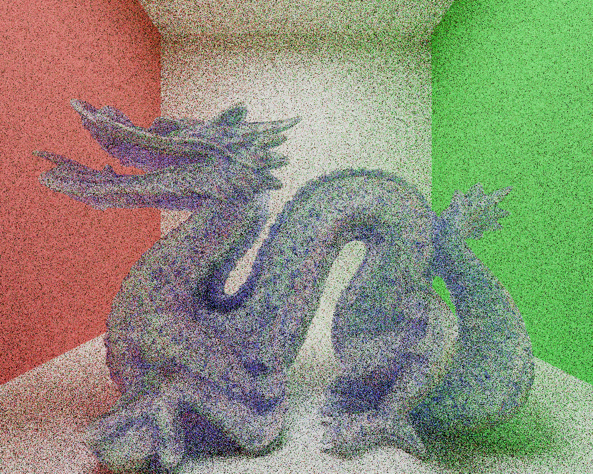 | 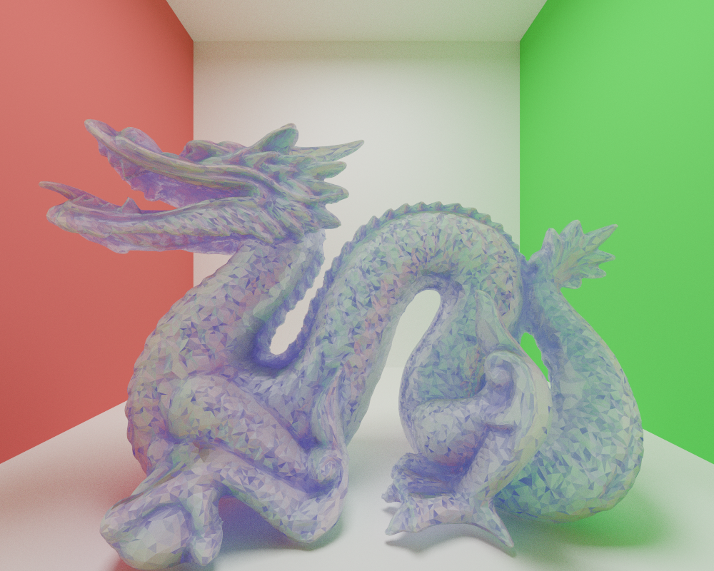 |

Direct lighting makes our renders converge with fewer iterations and less time than estimating without, since at each ray bounce, we sample how much direct light is also gathered there rather than waiting for our ray to eventually hit a light source at random. Furthermore, we are also able to render out scenes with point lights which would otherwise be impossible without direct lighting.

Since direct lighting requires us to compute a "shadow ray" to check whether or not it intersects with other objects in the scene before it hits a light, this adds an additional O(logN) computational expense (if we use BVH; if not, then O(N)). However, we find that it is faster with direct lighting to achieve similar quality results (evaluated by SNR) compared to that without, on our computer, due to there always being lighting contribution at each ray bounce, and not requiring us to rely on hoping that we hit a light source at some ray bounce.

Below, we show the linear SNR vs the amount of time it takes to render out our scene (keep ray depth at 64, with BVH on, all diffuse materials, single area light). We choose to evaluate our metric based on time rather than the number of iterations on the x axis since it is already given that direct lighitng converges better per iteration, and in general, people care more about how much time it takes to get something done anyway.

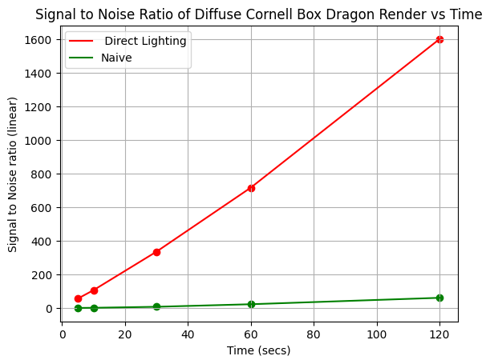 

| Time (s) | SNR, Direct Lighting | SNR, Naive |
|---------|---------------------|-----------|
| 5        | 57.44                | 1.83       |
| 10       | 107.81               | 2.71       |
| 30       | 336.46               | 8.67       |
| 60       | 717.40               | 23.91      |
| 120      | 1600.71              | 62.11      |

According to the graph, we see that the linear signal to noise ratio of direct lighting shows much better quality compared to the naive implementation (around 30 times better).

On the CPU, overall direct lighting computation/rendering a single pass with BVH would take O(MlogN) (M - number of rays in scene). On the GPU, this takes O(logN) due to multithreading with rays.

In order to optimize it beyond our current implementation, we can choose to have a ray prioritize closer lights/lights that would bring a higher contribution to a path's final radiance compared to just randomly choosing a light to sample. More modern methods like ReSTIR also help to reuse samples in neihgboring pixels as well.

here's a render using point lights

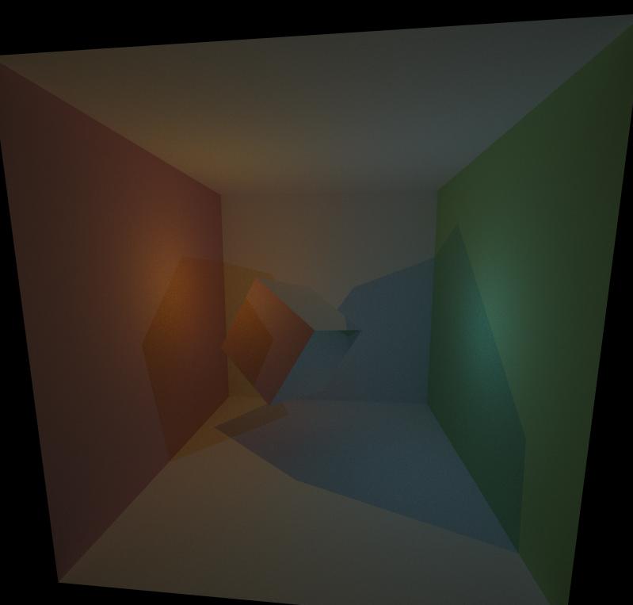 

## 5. Dielectric Materials
Dielectric materials are supported in this renderer, with a physically-accurate Fresnel reflectance calculation that utilizes Russian Roulette to determine whether or not to render our a reflective or transmissive material per pixel. 

| Dielectric material (IOR 2) | Purely specular | Purely transmissive |
| ------------- | ------------- | ------------- |
|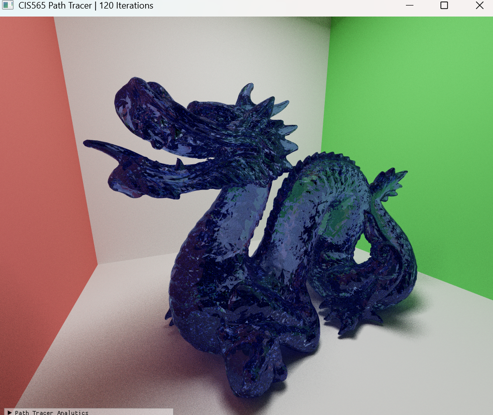 | 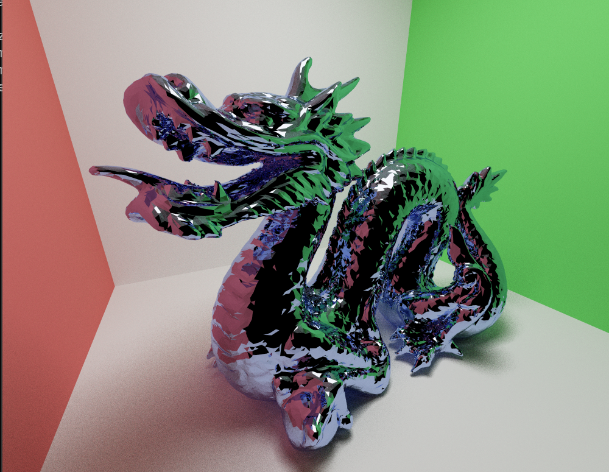 | 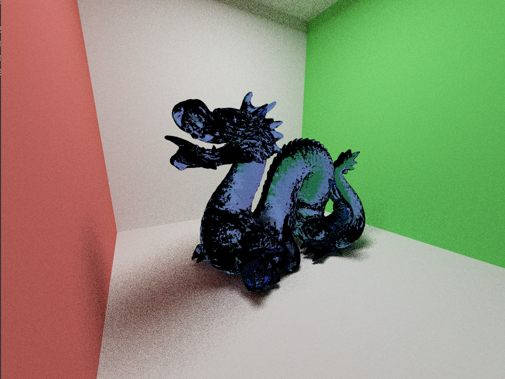 |

Below, we show a dielectric material for 3 different indices of refraction, as well as what the Fresnel reflectance factor looks like for each IOR.

|  Water (IOR 1.3) |  Glass (IOR 1.5) | Diamond  (IOR 2.4) |
| ------------- | ------------- | ------------- |
|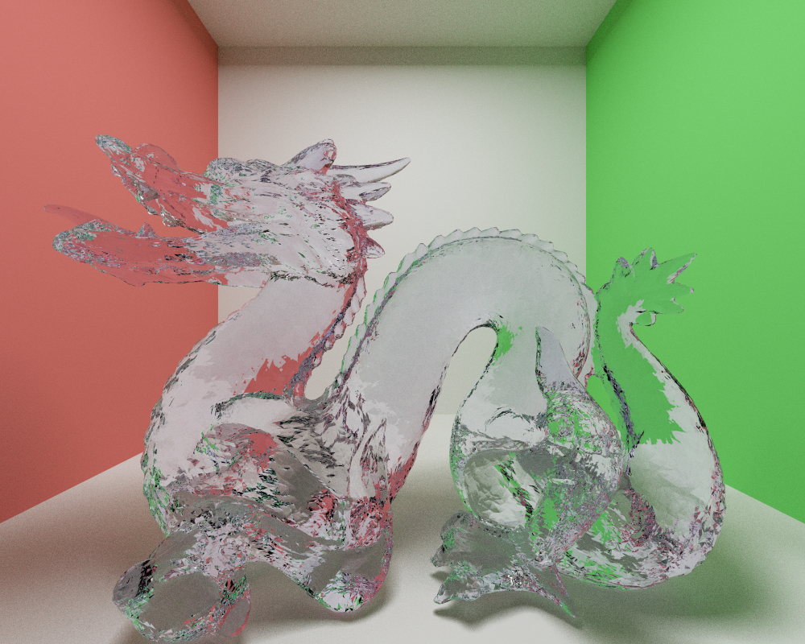 | 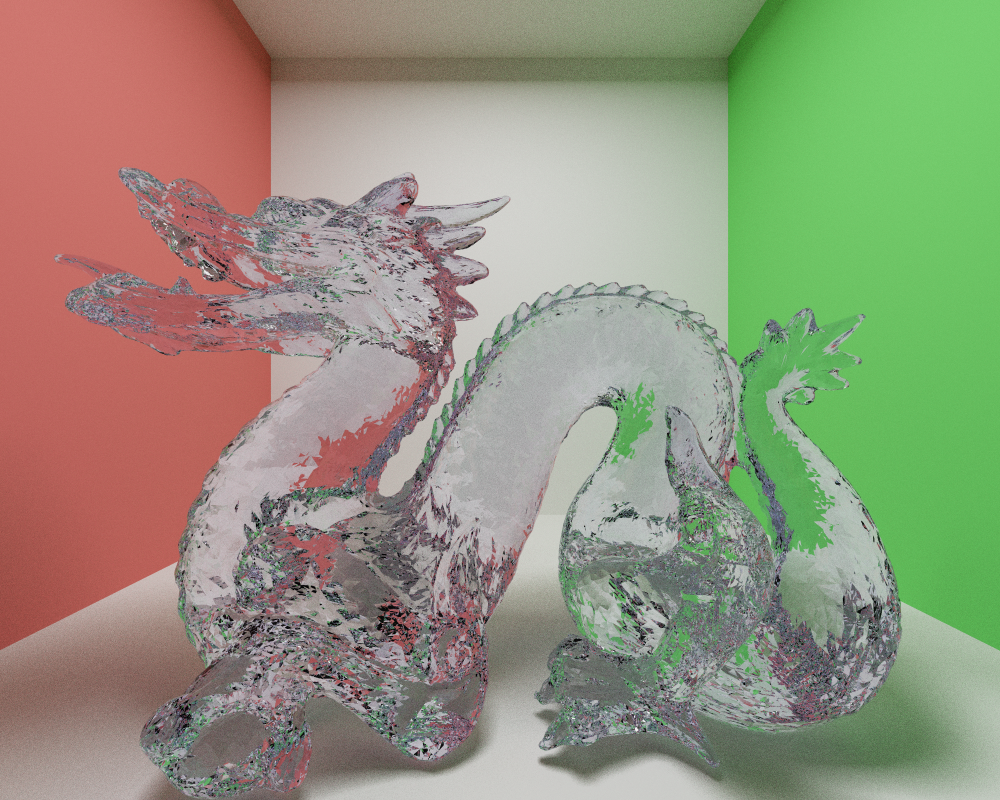 | 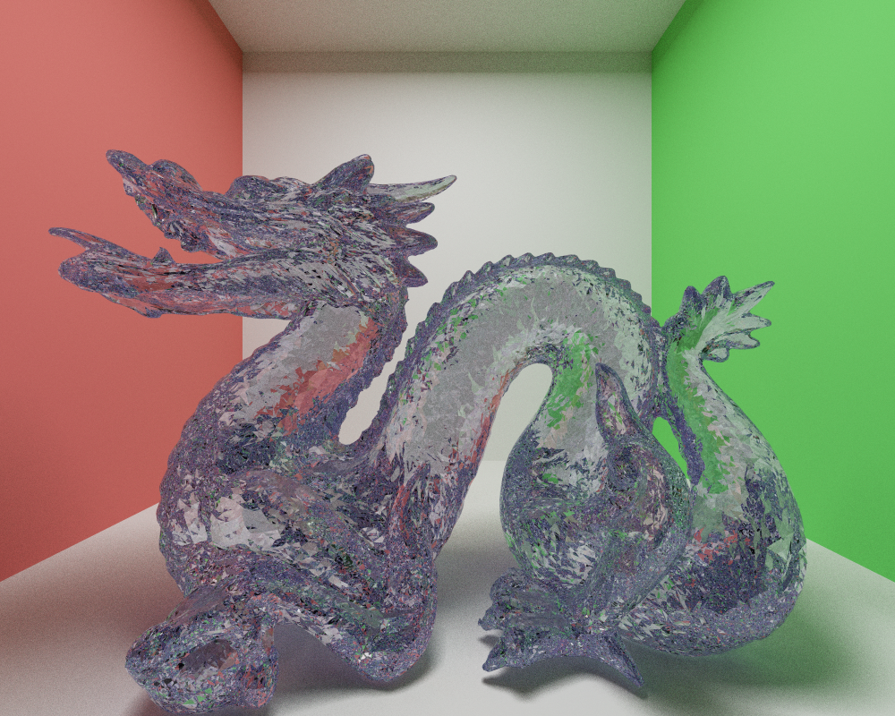 |
|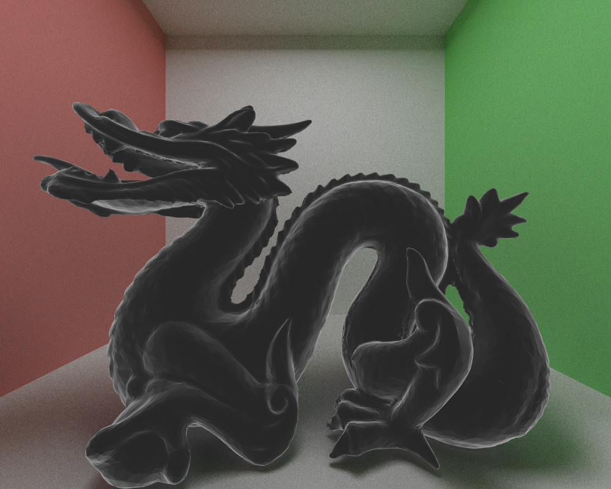 | 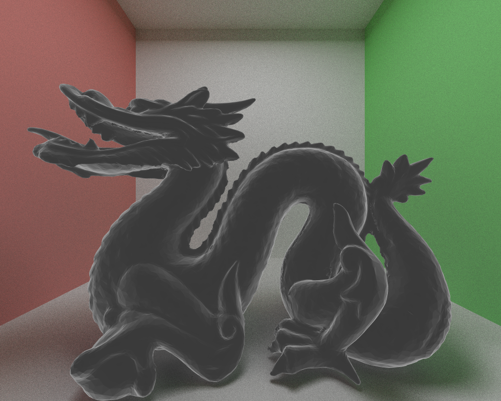 | 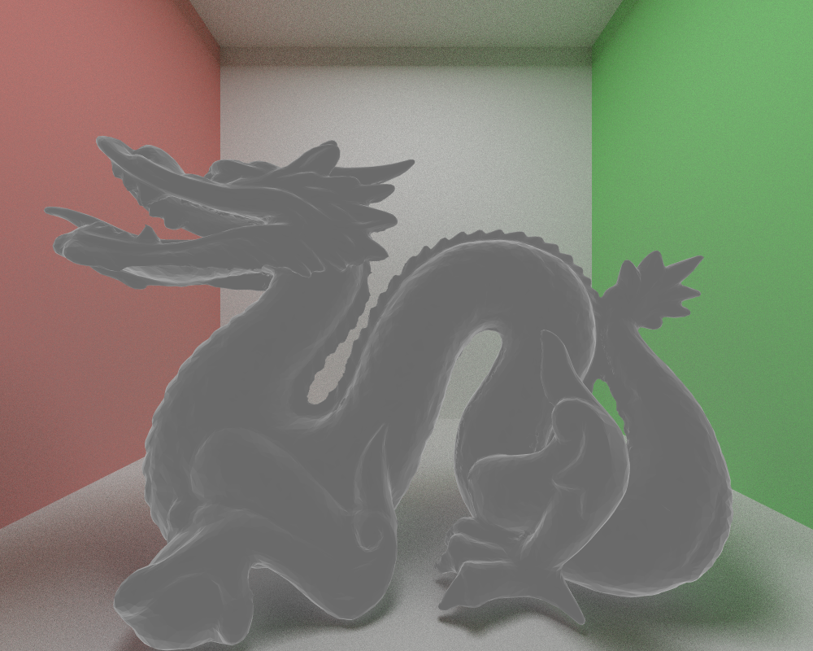 |

For the dragon cornell box scene which has 100,000 tris, comparing a dielectric material with IOR 2.0 to a pure reflective, pure transmissive, and pure diffuse material, it took 2.45 seconds to render out 5 iterations compared to 1.73, 49.3, and 5.71 seconds respectively, with a ray depth of 64. 

The biggest bottleneck in our dielectric material is due to transmission. Looking into NVIDIA Nsight Systems, for a purely transmissive material, most of the compute goes towards computeIntersections (taking up 99.3% of the process). It yields ~14 seconds to compute per iteration, shown below.

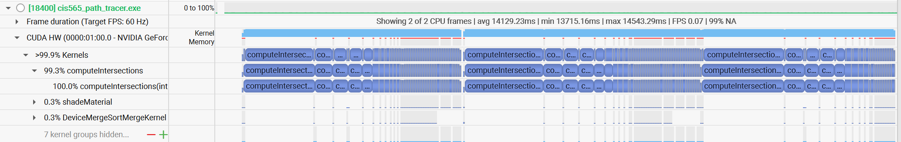 

For a pure reflective material, we see that computeIntersections significantly speeds up. Each iteration takes only ~0.3 seconds, and this time, computeIntersections only takes up 49.5% of the process, shown below.

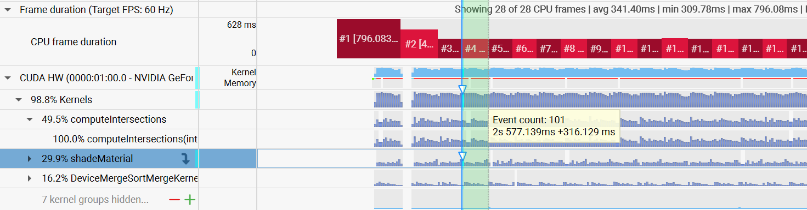 

For dielectric materials, which combines both reflective and refractive materials, computeintersections takes up 65.9% - in between reflective and transmissive - as expected, since we are performing both material calculations. Furthermore, each iteration takes on average ~0.7 seconds, shown below.
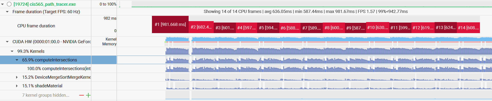 

Implementing dielectric materials on the GPU compared to the CPU yields a much faster result not just due to multithreading ray processes, but stream compaction allows us to terminate rays that end up having internal reflections or are reflected away.

In order to optimize our render beyond what we currently have, we could use a faster Fresnel factor calculation like Schlick's (although this suffers from being less physically accurate). We could also use caustic-aware techniques that sample rays that would contribute to higher radiance than not, in order to improve performance for computeIntersections, which takes up the biggest portion of GPU compute.

## Acknowledgements
- Horse, deer, and sheep sculptures taken from https://sketchfab.com/Miaolailai
- Used [tinyobjloader](https://github.com/tinyobjloader/tinyobjloader) for file parsing
- Project from [UPenn CIS5650: GPU Programming ](https://github.com/CIS5650-Fall-2026/Project3-CUDA-Path-Tracer)
- [Physically Based Rendering: From Theory to Implementation (pbr-book.org)](https://pbr-book.org/4ed/contents)

## More renders yay
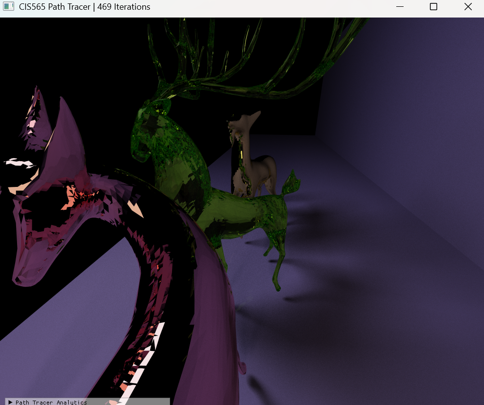 
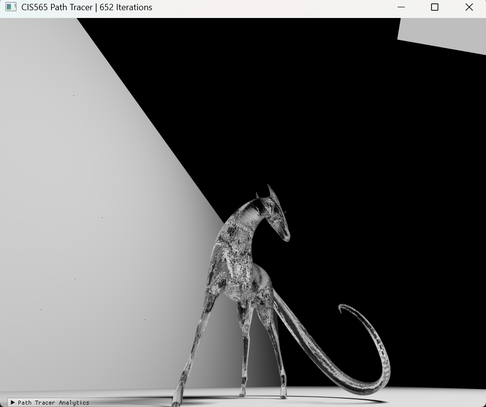 