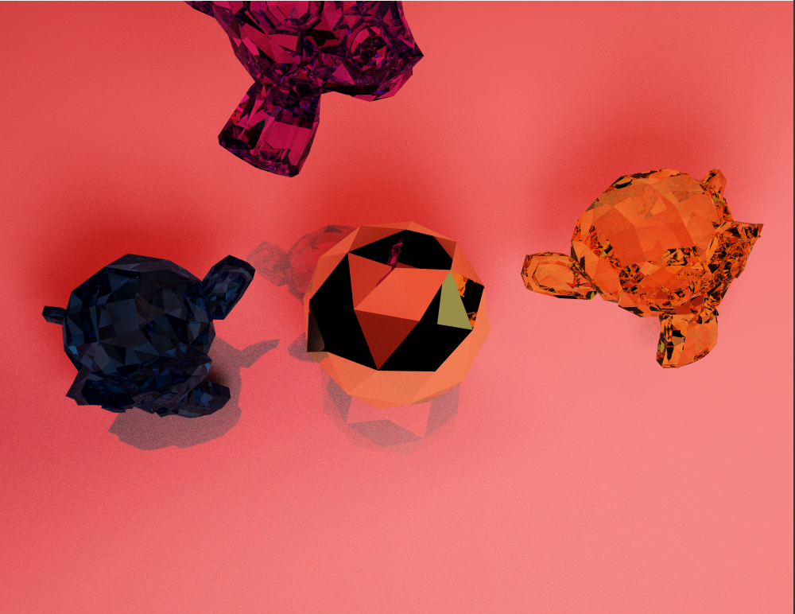
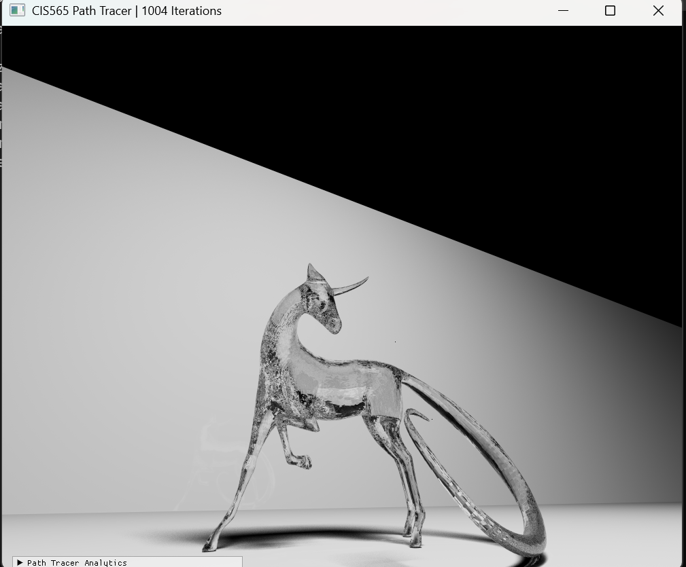

CUDA Path Tracer
================
### Resulting Renders

*1000 iterations, models from https://sketchfab.com/Miaolailai*

| Monkeys render — 173 iterations | Horses render — 1004 iterations |
| ------------- | ------------- |
| ! | |

Rebecca Feng
  * = [LinkedIn](https://www.linkedin.com/in/beckyfeng0803/), [personal website](https://beckyfeng08.github.io/)
Tested on: Windows 11, AMD Ryzen 9 @ 2.50 GHz 8GB, GTX 5060
Visual Studio 2022, CUDA 13.3
